# Hash table, its optimization and hash funcions' quality research

1. [General information](#general-information)
2. [Building](#building)
3. [Dependencies](#dependencies)
4. [Hash functions research](#hash-functions-research)
    1. [Cringe_1](#cringe1)
    2. [ASCII_Hash](#asciihash)
    3. [Len_Hash](#lenhash)
    4. [Checksum](#checksum)
    5. [Ded_Hash](#dedhash)
    6. [SHA_256](#sha256)
    7. [Conclusion](#conclusion)
5. [Hash table optimizaton](#hash-table-optimization)
    1. [Version_0](#version-0)
    2. [Version_1](#version-1)
    3. [Version_2](#version-2)
    4. [Version_3](#version-3)
    5. [Version_4](#version-4)
    6. [Conclusion](#conclusion-1)

# General information

This project is C implementation of *hash table* - a well known data structure. My hashtable supports 6 hash functions which quality was carefully studied and is presented below. A unique feature of this projects is its second part - optimization of hash table with the help of knowlendge in processor architecture.

# Building

Using my hash table is quite simple.

**Step 1:** Clone this repository
```bash
$ git clone git@github.com:KetchuppOfficial/Hash_Table.git
```

**Step 2:** Build the project
```bash
$ make
```
If building ended well you'll see a similar message:
```bash
ketchupp@ketchupp-HVY-WXX9:~/Programming/Semester_2/Hash_Table/Not_Optimized$ make
gcc -c -g -Wall -Werror -Wshadow -Wfloat-equal -Wswitch-default main.c  -o main.o
gcc -c -g -Wall -Werror -Wshadow -Wfloat-equal -Wswitch-default Hash_Table.c  -o Hash_Table.o
gcc -c -g -Wall -Werror -Wshadow -Wfloat-equal -Wswitch-default ../Dump/Hash_Table_Dump.c -o ../Dump/Hash_Table_Dump.o
gcc -c -g -Wall -Werror -Wshadow -Wfloat-equal -Wswitch-default ../Hash_Research/Hash_Research.c  -o ../Hash_Research/Hash_Research.o
gcc main.o Hash_Table.o ../Dump/Hash_Table_Dump.o ../Hash_Research/Hash_Research.o ../../../SHA_256/sha_256.a ../../../My_Lib/My_Lib.a -o Hash_Table.out
rm main.o
rm Hash_Table.o
rm ../Dump/Hash_Table_Dump.o
rm ../Hash_Research/Hash_Research.o
```

All version of the hash table (Not_Optimized, Version_O, ..., Version_4) are built with degub information (-g) and no optimization flags.

**Step 3:** Running
```bash
$ make run
```

If you wand to delete an executable file (Hash_Table.out) and a log file (log_file.log), run:
```bash
$ make clean
```

# Dependencies

This project consists of both new code and two static libraries that were also implemented by me some time ago.

## My_Lib

The 1st library is [My_Lib](https://github.com/KetchuppOfficial/My_Lib) that is used for work with files and debugging with the help of log files.

## SHA_256

The 2nd library is [SHA_256](https://github.com/KetchuppOfficial/SHA_256) that is an implementation of a well known hash function SHA-256 based on information from [Wikipedia](https://en.wikipedia.org/wiki/SHA-2).

## Paths to libraries

If relative paths from files of this projects to the mentioned libraries differ from the default ones, you have to change them in [Hash_Table.h](https://github.com/KetchuppOfficial/Hash_Table/blob/master/Hash_Table.h).

```C
#ifndef HASH_TABLE_INCLUDED
#define HASH_TABLE_INCLUDED

#include <stdlib.h>
#include <inttypes.h>
#include <string.h>
#include <ctype.h>

#include "../../SHA_256/sha_256.h"  // <------- Change here

#include "../../My_Lib/My_Lib.h"    // <------- And here
```

# Hash functions research

**Experiment conditions.** Hash table was filled with words of *"The Lord of the Rings"*. If a word has already been added, it won't be added again. Sequently, each word differs from others. Choosing an exact size of the hash table was based on specifics of each hash function.

As it was mentioned earlier, my hash table can use one of 6 hash function. The following is pieces of information about each on of them and graphs that show a number of worlds in every cell of the hash table. As far as two words in any pair differ from each other, this experiment is a way to estimate the number of collisions of all 6 hash functions.

## Cringe_1

Returns 1 regardless of input data.
```C
static uint64_t Cringe_1 (const char *data)
{
    return 1;
}
```

**Hash table size:** 20 cells.

As far as the output of *Cringe_1 ()* is known from the very beginnig, the size was chosen resonably small.

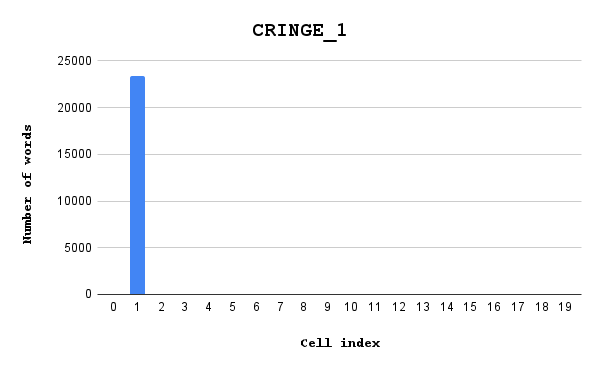

## ASCII_Hash

Returns ASCII-code of the first letter of a string.
```C
static uint64_t ASCII_Hash (const char *data)
{
    return (uint64_t)data[0];
}
```
**Hash table size:** 128 cells. 

Since ASCII-codes belong to [0; 255] and John Ronald Reuel Tolkien could use only first 128 of them, the size was chosen appropriate.

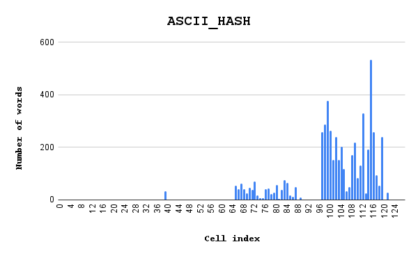

## Len_Hash

Returns the length of a string.
```C
static uint64_t Len_Hash (const char *data)
{
    return strlen (data);
}
```
**Hash table size:** 50 cells. 

As the ordinary length of words in fiction is obviously less than 50, the size was chosed a little overstated.

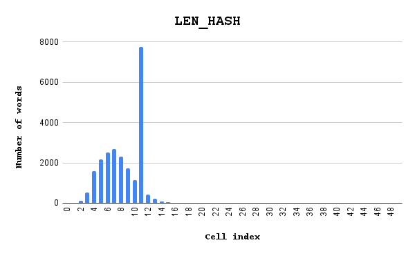

## Checksum

Returns sum of ASCII-codes of letters of a string.
```C
static uint64_t Checksum (const char *data)
{
    uint64_t checksum = 0U;
    
    for (int i = 0; data[i] != '\0'; i++)
        checksum += data[i];

    return checksum;
}
```
**Hash table size:** 2000 cells. 

Three previous function was a kind of joke and shouldn't be treated seriously. Since *Checksum ()* hash function are *real*, if it can be said this way. Here and further the size of the hash table is 2000 cells. The load factor is approximately 8,24 as there are 16485 words in the hash table.

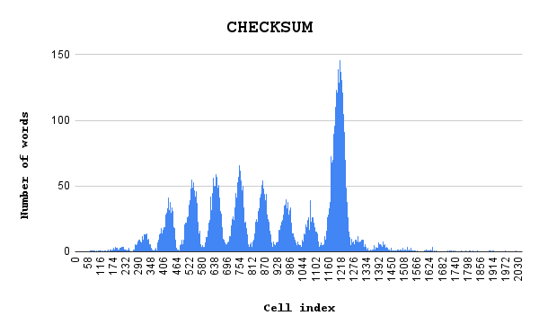

## Ded_Hash

I was informed about this function by my teacher [Ded](https://github.com/ded32).
```C
static inline uint64_t ror(uint64_t num, uint64_t shift)
{
    return (num >> shift) | (num << (64 - shift));
}

static uint64_t Ded_Hash (const char *data)
{
    uint64_t hash = data[0];

    for (int i = 0; data[i] != '\0'; i++)
        hash = ror (hash, 1) ^ data[i];

    return hash;
}
```

**Hash table size:** 2000 cells

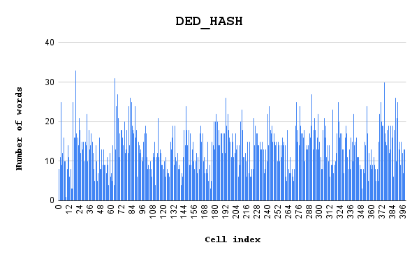

## SHA-256

Implementation of this function can be seen on the GitHub page of my SHA-256.

**Hash table size:** 2000 cells

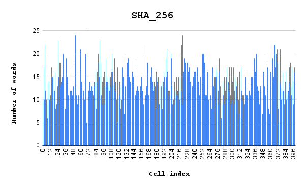

## Conclusion

SHA-256 has shown the best result. Nevertheless, Ded_Hash is also not bad. Because the algorithm of SHA-256 is kind of difficult, we will use Ded_Hash in the second part of work.

# Hash table optimization

I used *callgrind* to get profiling data and *kcachegrind* to visualize it. There are some references to "clock signals" below. It means processor clock signals I got information about from the lowest line of *kcachegrind* window.

## Version 0

There are no optimizations in this version. It differs from hash table from [Not_Optimized](Not_Optimized) folder in some ways but these differences are minor (dump and counting collisions were removed, for example). It takes 291 382 650 clock signals to execute this program. Let's think how can we optimize hash table to make it work faster.

As we see in the picture below, execution of *Divide_In_Words* takes the longest time. 

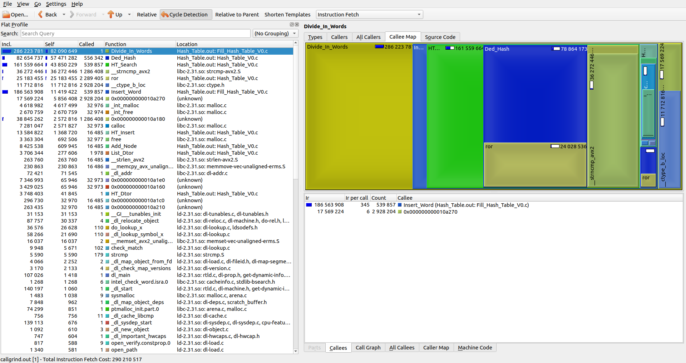

It seems logical to optimize this very function at first. Nevertheless, if we look at the callee map, we can see that *Divide_In_Words* calls *Insert_Words*. This function itself calls *HT_Search* and *HT_Inset*:

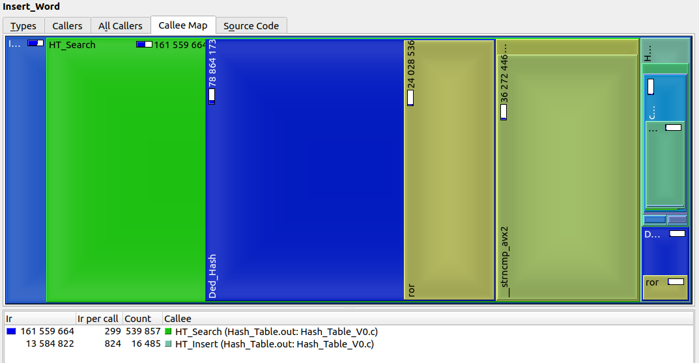

It looks like we've found a function to optimize. It should he *HT_Search*. But may we dig a little dipper and see which functions are called by *HT_Search*.

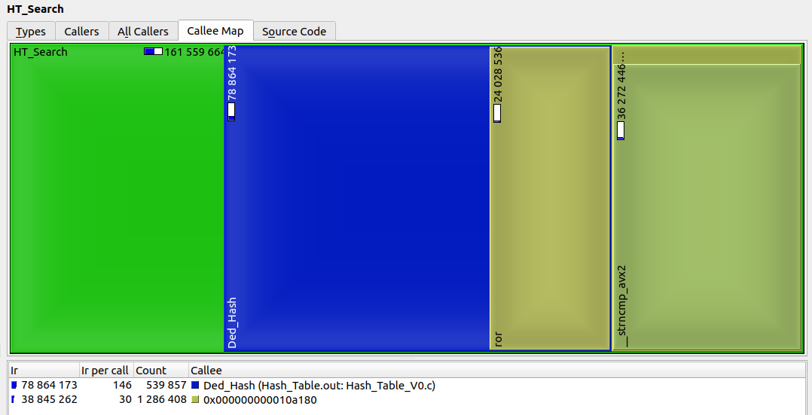

It turns out *HT_Search* calls *Ded_Hash* and some nonsense (it is *_strncmp_avx2* actually). We finally identified which functions are the slowest, so let's optimize them. I consider doing it gradually is a good idea. We will optimize *Ded_Hash* and *strncmp* after that. Then we will see which optimization made the greatest contribution to speeding hash table up.

## Version 1

As it was said, I started with optimizing *Ded_Hash* function. I've chosen to implement it in the assembly language to achieve the best performance. Here is the source code (you can also look at it [here](Optimized/Version_1/Ded_Hash.s)):

```assembly
Ded_Hash:

    movzx rax, byte [rdi]
    xor rcx, rcx

    jmp .condition

.for:

    ror rax, 1
    movzx rbx, byte [rdi + rcx]
    xor rax, rbx
    inc rcx

.condition:

    cmp [rdi + rcx], byte 0
    jne .for

    ret
```

Let's see how have the hash table performance changed.

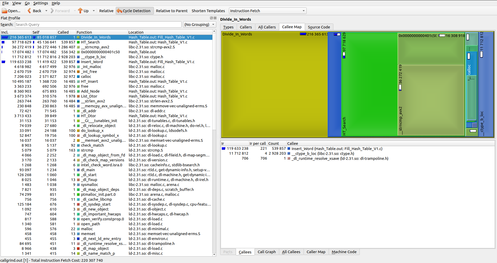
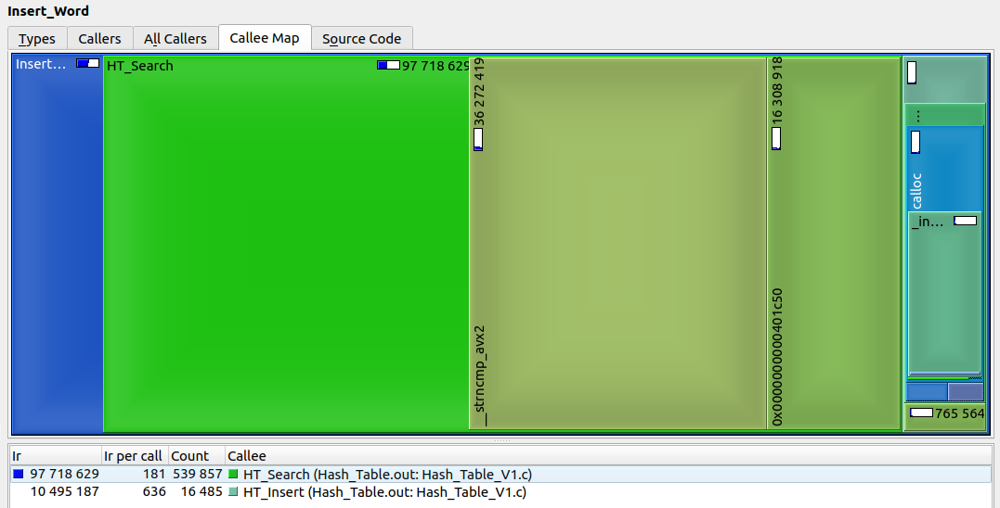
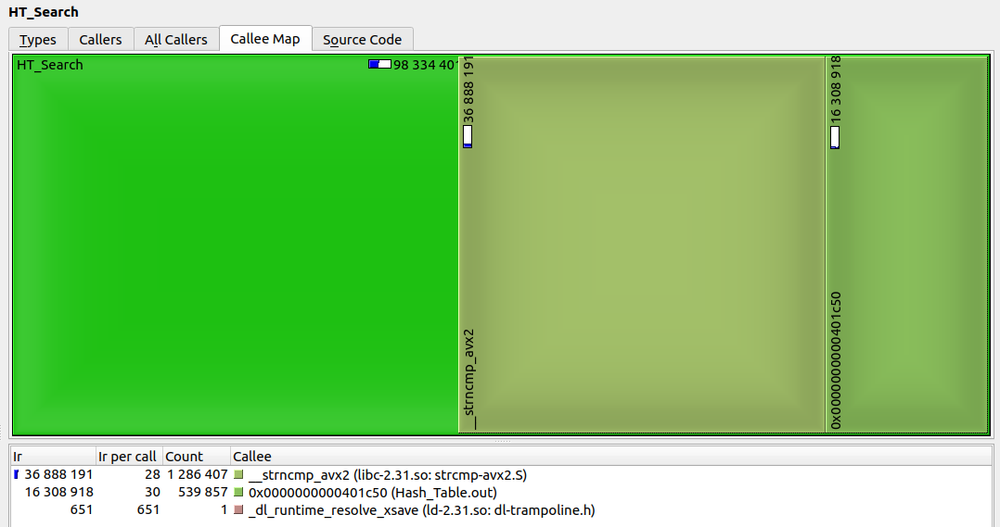

Speaking about the number of clock signals, we've got approximately 24,4% boost. It's a good result actually. But we still have *strncmp* to optimize. Let's do it.

## Version 2

I could use Intel<sup>&reg;</sup> intrinsics to accelerate *strcmp* but absence of optimization flags for the compiler ruins this idea. It we don't use -O2, intrinsics will work very slow because of being pushed into RAM instead of registers. As I use no optimization flags, the only option is to implement a function to compare strings in the assembly language. Here is the source code (you can also look at it [here](Optimized/Version_2/Str_Cmp_SSE.s)):

```assembly
Str_Cmp_SSE:
    
        xor     r10, r10                    ; chars counter
        mov     r9, rdx                     ; saving len

        mov     rax, 16                     ; len_1 for pcmpestri          
        mov     rdx, 16                     ; len_2 for pcmpestri

        jmp     .condition

.for:

        movups  xmm1, [rdi + r10]           ; loading str_1
        movups  xmm2, [rsi + r10]           ; loading str_2

        pcmpestri xmm1, xmm2, 00001100b ; ---+
        ;                                    |
        ;                                    | LOOK HERE (find more in intel docs)
        ;                                   \|/
        ;                                    *
        ;               no effect -> 0 0 0 0 1 1 0 0 b
        ;                              \./ | \./ |  \.
        ;                          ____/   |  |   \.  128-bit sources are treated as 16 packed bytes
        ; index encodes least    /         |   \.   bytes are unsigned
        ; significant byte of res2        /      mode is equal ordered
        ;                           res2 = res1  

        test    ecx, ecx                    ; checking if string are equal
        jne     .not_equal

        add     r10, 16                     ; move to the next 16 bytes

.condition:
        cmp     r10, r9                     ; compare up to the end of str_1
        jb      .for

        xor     rax, rax                    ; return 0, if equal
        ret

.not_equal:
        mov     rax, 1                      ; return 1, if not equal
        ret   
```

The results or profiling are:

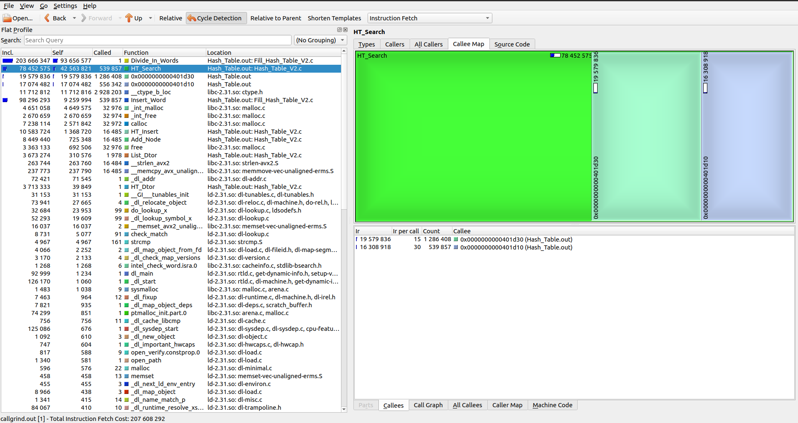
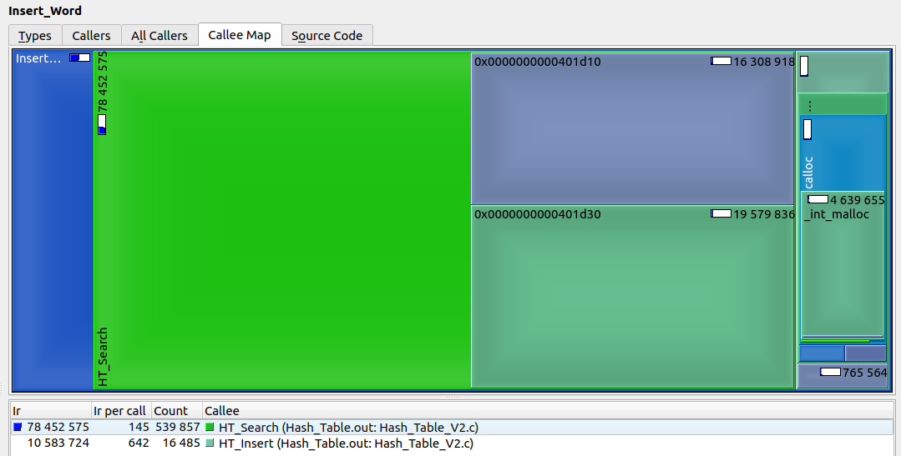
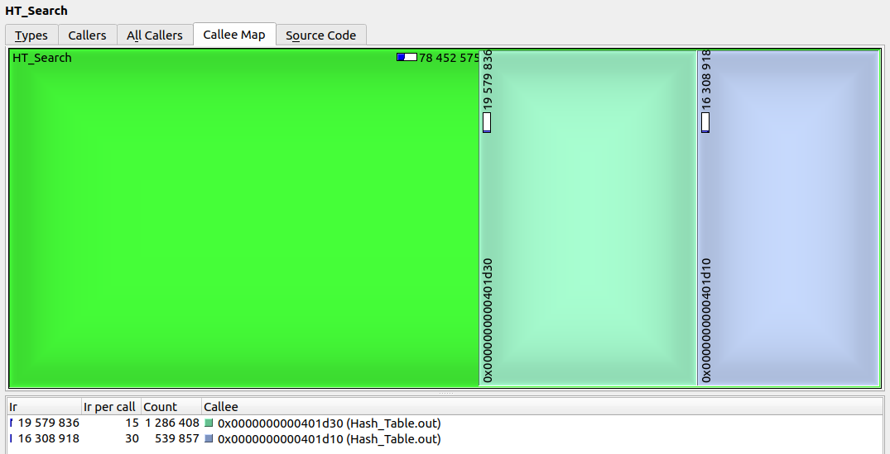

After this optimization, the program undoubtedly works faster but the boost is only 9,4% comparing to [Version_1](Optimized/Version_0) and 28,8% comparing to [Version_0](Optimized/Version_1). The result is worse than after the first optimization but still good enough to continue.

## Version_3

As they say, rewrite, so big. I was curious and looked how gcc compiles *HT_Search* function. Here is a small piece of assembly code:

```assembly
HT_Search:
.LFB15:
	.cfi_startproc
	endbr64
	push	rbp
	.cfi_def_cfa_offset 16
	.cfi_offset 6, -16
	mov	rbp, rsp
	.cfi_def_cfa_register 6
	sub	rsp, 48
	mov	QWORD PTR -40[rbp], rdi
	mov	QWORD PTR -48[rbp], rsi
	mov	rax, QWORD PTR -40[rbp]
	mov	rdx, QWORD PTR 8[rax]
	mov	rax, QWORD PTR -48[rbp]
	mov	rdi, rax
	call	rdx
	mov	QWORD PTR -8[rbp], rax
	mov	rax, QWORD PTR -40[rbp]
	mov	rcx, QWORD PTR 16[rax]
	mov	rax, QWORD PTR -8[rbp]
	mov	edx, 0
```

The idea is that gcc pushes parameters of the function into the stack and then works with them via RAM. No one will argue that this method is way slower than using registers. That's why I decided to rewrite the whole *HT_Search* function in the assembly language.

There is a but: since Version_3 hash table can be used only with *Ded_Hash* as a hash function. You can't choose hash function anymore. I've done this because having more than one hash function obliges to use a pointer on a function as a field of hash table structure or to implement various *HT_Search*, *HT_Insert* and *HT_Delete*: one for each hash function. The first solution decreases speed and the second is not interesting to solve. I suppose everybody can write exactly the same pieces of code replacing a specific part of them. 

Good news is that I inlined *Ded_Hash* into *HT_Search* that should make a positive impact on the performance. However, we still need *Ded_Hash* implementation in an independent file for *HT_Insert* and *HT_Delete*. You can see brand new *HT_Search* [here](Optimized/Version_3/HT_Search.s).

No let's see what have callgrind got.

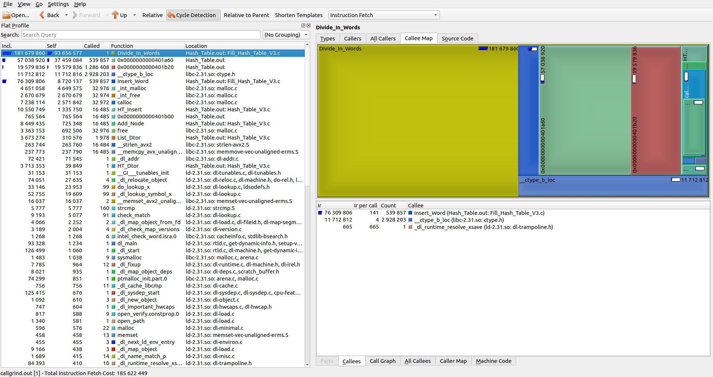
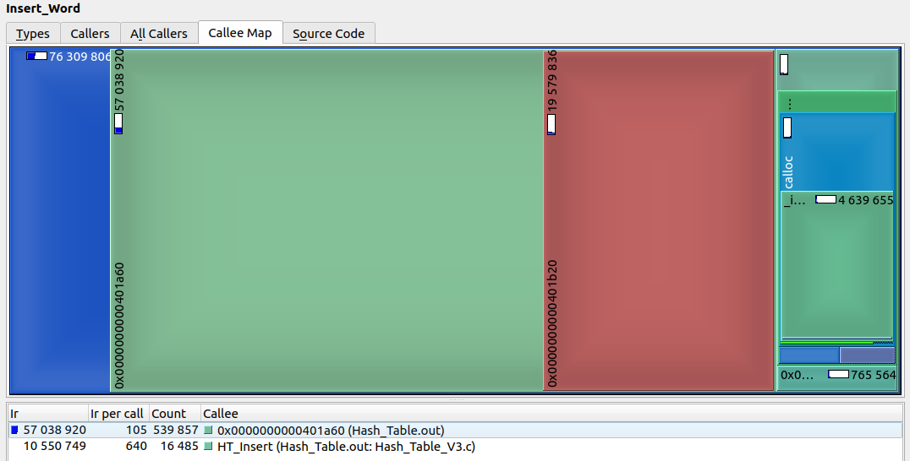

The hash table accelerated by approximately 10,6% comparing to Version_2; total acceleration is about 36,3%.

Let's see on the result more carefully. *HT_Search* is still executed 5,7 times slower than *HT_Insert* and there's nothing else to optimize in *HT_Search*. Well, maybe there is but I won't compete with gcc enpowered with -O2 in the sport "Who puts variables in registers better?" as I'll lose. 

What should we do next? *Insert_Word* still takes the longest execution time of *Divide_In_Words* but *Insert_Word* is optimized as much as possible. Look at the current realization: the function is as simply as it can be (don't look at the conditional compilation).

```C
#if DEBUG == 1
static inline int Insert_Word (struct Hash_Table *ht_ptr, char *const str, const long letter_i)
#elif DEBUG == 0
static inline void Insert_Word (struct Hash_Table *ht_ptr, char *const str, const long letter_i)
#endif
{
    if (HT_Search (ht_ptr, str) == NOT_FOUND)
    {
        #if DEBUG == 0
        HT_Insert (ht_ptr, str);
        #elif DEBUG == 1
        int ret_val = HT_Insert (ht_ptr, str);
        MY_ASSERT (ret_val != ERROR, "HT_Insert ()", FUNC_ERROR, ERROR);
        return 1;
        #endif
    }

    #if DEBUG == 1
    return 0;
    #endif
}
```

Of course, I can try to speed *HT_Insert* up but it won't result in a great increase in the performance as *HT_Insert* already works way faster than *HT_Search* (it's on the 9th position in the callgrind list). I think it's time to leave *Insert_Word* and move forward.

## Version_4

The next function that can be boosted is mysterious *__ctype_b_loc*. Actually, there is no mystery, just good old *isalpha*. Let's completely remove it by changing
```C
if ( isalpha (buffer[symb_i]) || buffer[symb_i] == '\'')
    str[letter_i++] = buffer[symb_i];
```
into
```C
if ( ('a' <= buffer[symb_i] && buffer[symb_i] <= 'z') || 
     ('A' <= buffer[symb_i] && buffer[symb_i] <= 'Z') || 
                               buffer[symb_i] == '\'')
    {
        str[letter_i++] = buffer[symb_i];
    }
```
and look what it will lead to.

Callgrind arrives with great news!

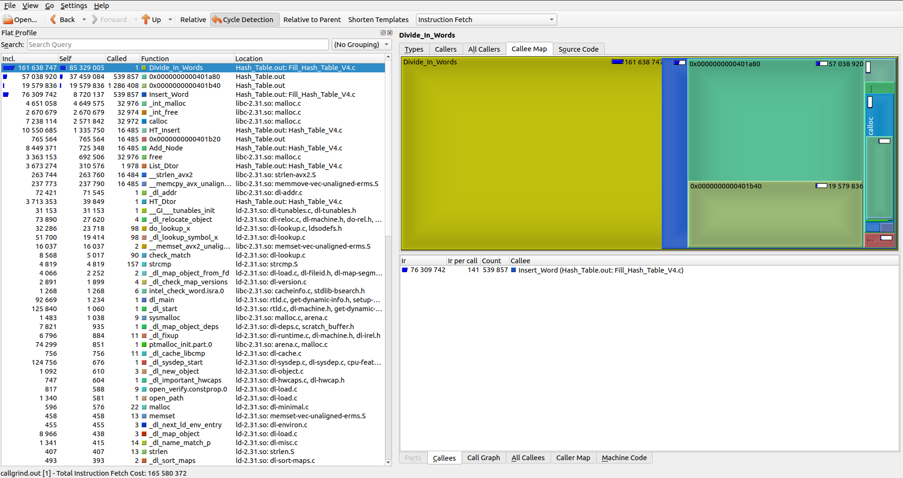

Comparing to Version_3, the boost is approximately 10,8%. Total boost is about 43,2%.

As we see in the last picture, functions on lines 2-4 are already optimized. Optimizing *HT_Insert* isn't reasonalbe (as it was mentioned). I'm obviously not good enough to make *malloc*, *calloc*, *strlen* and *memcpy* better than they already are. We can continue improving performance of *Divide_In_Words* but we won't. Firstly, this function is just a test for functions that work with hash table such as *HT_Insert* and *HT_Search*. That's why optimizing it won't optimize hash table itself. Secondly, apart from calling *HT_Search* and *HT_Insert* *Divide_In_Words* has conditional operators and a cycle. We could try to optimize them by implementing this function in the assembly language but gcc with -O2 flag would do a better job. So, Version_4 is the last one.

## Conclusion

We succeded in accelerating the work of hash table. It took 291 382 650 clock signals to execute Version_0 and only 165 580 372 to execute Version_4 that is approximately 43,2% boost. Let's compare the final result with Version_0 compiled with flags -O1, -O2 and -O3.

|                 | Clock signals |
|-----------------|---------------|
| My optimization |  165 580 372  |
|       -O1       |  134 331 275  |
|       -O2       |  135 796 371  |
|       -O3       |  135 617 014  |

The result is that my optimization is relatively close to the result of gcc with any optimization flag. Let's calculate the most important coefficient that is widely known Ded_Coefficient.

Ded_Coefficient = (acceleration value / number of assembly lines) * 1000

We will count only instruction and won't count comments, labels or names of functions. Taking this into consideration, we find: Ded_Hash.s - 10 lines, HT_Search.s - 48 lines, Str_Cmp_SSE.s - 17 lines. All in all:

Ded_Coefficient = (43,2 / 75) * 1000 = 576
