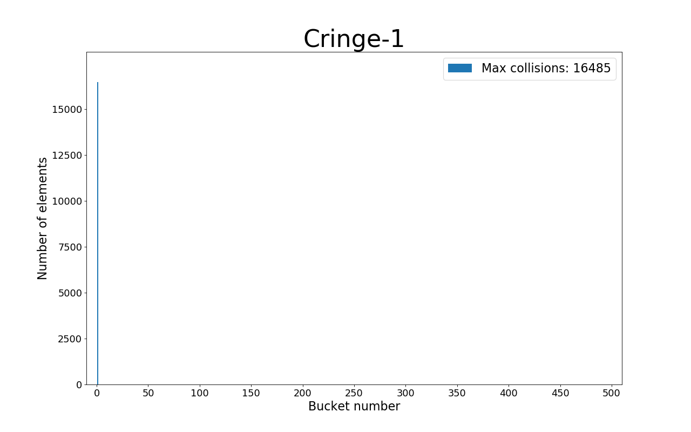
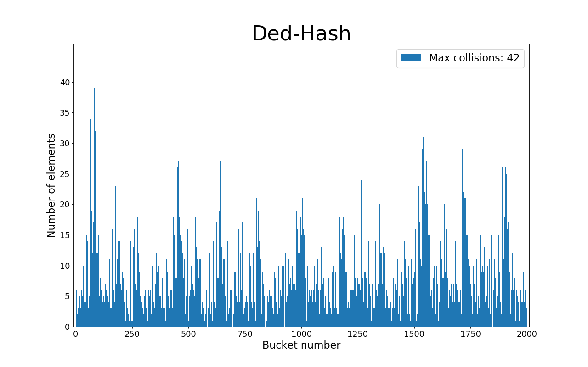
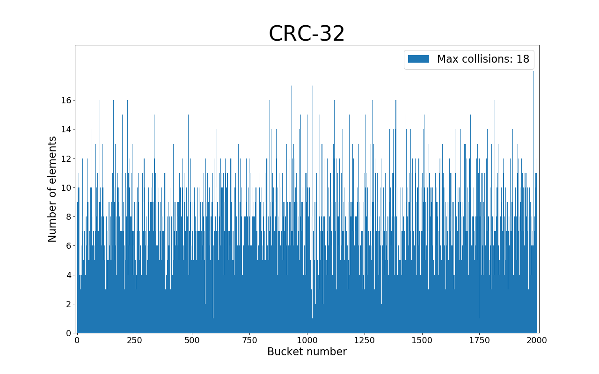
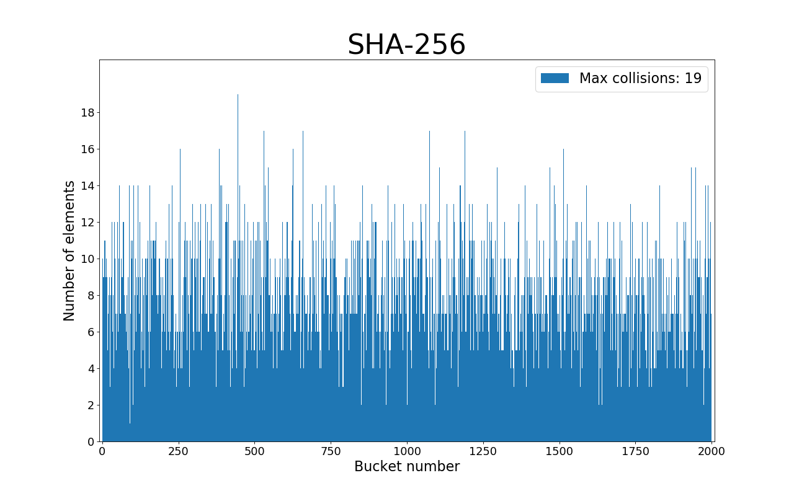

# Hash table, its optimization and hash functions quality research

1. [General information](#general-information)
2. [Dependencies](#dependencies)
3. [Building](#building)
4. [Hash functions research](#hash-functions-research)
    1. [Experiment_Conditions](#experiment-conditions)
    2. [Cringe_1](#cringe1)
    3. [ASCII_Hash](#asciihash)
    4. [Len_Hash](#lenhash)
    5. [Checksum](#checksum)
    6. [Ded_Hash](#dedhash)
    7. [CRC_32](#crc-32)
    8. [SHA_256](#sha256)
    9. [Conclusion](#conclusion)
5. [Hash table optimizaton](#hash-table-optimization)
    1. [Version_0](#version-0)
    2. [Version_1](#version-1)
    3. [Version_2](#version-2)
    4. [Version_3](#version-3)
    6. [Conclusion](#conclusion-1)

# General information

This project is a C implementation of **hash table** - a well known data structure. My hash table supports 7 hash functions, which quality were carefully studied. A unique feature of this project is its second part - optimization of hash table with the help of knowledge in processor architecture.

# Dependencies

This project consists of both new code and two static libraries that were also implemented by me some time ago.

## My_Lib

The 1st library is [My_Lib](https://github.com/KetchuppOfficial/My_Lib) that is used for work with files and debugging with the help of log files.

## SHA_256

The 2nd library is [SHA_256](https://github.com/KetchuppOfficial/SHA_256) that is an implementation of a well known hash function SHA-256 based on information from [Wikipedia](https://en.wikipedia.org/wiki/SHA-2).

## Paths to libraries

Set your own path(s) to folder(s) with the libraries in **all** Makefiles (you should set path to only MY_LIB_PATH since Version_0):
```Makefile
CC     = gcc
CFLAGS = -Wall -Werror -Wshadow -Wfloat-equal -Wswitch-default

DBG = -g

SHA_LIB_PATH = /home/ketchupp/Programming/SHA_256/      # <---- here
MY_LIB_PATH  = /home/ketchupp/Programming/My_Lib/       # <---- and here

# don't forget about backslash in the end of each path!
```

# Building

Using my hash table is quite simple.

**Step 1:** Clone this repository
```bash
git clone git@github.com:KetchuppOfficial/Hash_Table.git
```

**Step 2:** Build the project
```bash
ketchupp@ketchupp-HVY-WXX9:~/Programming/Semester_2/Hash_Table/Not_Optimized$ make
Collecting dependencies for "src/Hash_Research.c"...
Collecting dependencies for "src/Hash_Table_Dump.c"...
Collecting dependencies for "src/Hash_Table.c"...
Collecting dependencies for "src/main.c"...
Compiling "src/main.c"...
Compiling "src/Hash_Table.c"...
Compiling "src/Hash_Table_Dump.c"...
Compiling "src/Hash_Research.c"...
Linking project...
```

Some options are supported:
1) You can make a .png image of the hash table using (only in Not_Optimized version):
```bash
make OPT=-DDUMP
```
2) You can turn on all **MY_ASSERT** macros from **My_Lib** and showing the number of word in the hash table (kind of debug mode):
```bash
make OPT=-DDEBUG
```
3) Previous options can be used simultaneously:
```bash
make OPT=-DDEBUG\ -DDUMP    # don't forget backslash!
```

All version of the hash table (Not_Optimized, Version_O, ..., Version_3) are built with debug information (**-g** flag). Version_1, ... Version_3 have to be built with **-O1**, **-O2** or **-O3** flag.

**Step 3:** Running
```bash
make run
```

If you wand to delete all object and dependencies files from `./build/`, run:
```bash
make clean
```

**Extra step:** Profiling

Version_0, ..., Version_3 support measuring their performance by **callgrind** and **kcachegrind**. To use it, run:

```bash
make profile
```

# Hash functions research

## Experiment conditions

Hash table was filled with words of *"The Lord of the Rings"*. If a word has already been added, it won't be added again. Consequently each word differs from others. It means that this experiment is a way to estimate the quality of a hash function.

My program calculates the number of collisions in every bucket and prints it into a .txt file. This data is visualized as bar charts with the help of python script [Bar_Chart.py](/Not_Optimized/src/Histogram.py).

The size of the hash table was chosen to be 2000 so that the load factor is approximately 8,24 (less than 10). The maximum value on the Ox axis of the first 3 bar charts is 500 instead of 2000. That's because there were no words in hash table buckets with indexes [500, ..., 1999] while using first 3 hash functions.

## Cringe_1

Returns 1 regardless of input data.
```C
static inline uint32_t Cringe_1 (const char *data)
{
    return 1;
}
```



This function is obviously the worst hash function ever because only one list is filled with elements.

## ASCII_Hash

Returns ASCII-code of the first letter of a string.
```C
static inline uint32_t ASCII_Hash (const char *data)
{
    return (uint32_t)data[0];
}
```


Although **ASCII_Hash** is better than **Cringe_1**, it is not of a high quality because there is a great number of empty lists in the hash table.

## Len_Hash

Returns the length of a string.
```C
static inline uint32_t Len_Hash (const char *data)
{
    return strlen (data);
}
```


**Len_Hash** is even worse than **ASCII_HASH**: the number of empty lists and the maximal number of collisions increased.

## Checksum

Returns sum of ASCII-codes of letters of a string.
```C
static inline uint32_t Checksum (const char *data)
{
    uint32_t checksum = 0U;
    
    for (int i = 0; data[i] != '\0'; i++)
        checksum += data[i];

    return checksum;
}
```


**Checksum** is definitely better than previous hash functions, but it's not good enough too. Distribution of data by lists is not uniform.

## Ded_Hash

This function is usually called **ror hash**, but in my work I named after my teacher[Ded](https://github.com/ded32), who told me about this function.
```C
static inline uint32_t ror_32 (uint32_t num, uint32_t shift)
{
    return (num >> shift) | (num << (__CHAR_BIT__ * sizeof (uint32_t) - shift));
}

static inline uint32_t Ded_Hash (const char *data)
{
    uint32_t hash = data[0];

    for (int i = 0; data[i] != '\0'; i++)
        hash = ror_32 (hash, 1) ^ data[i];

    return hash;
}
```



## CRC-32

An implementation of **CRC_32** can be seen [here](Not_Optimized/src/Hash_Table.c).



**CRC_32** have shown the best result among previous hash functions. The maximal number of collisions is of the same order as the load factor.

## SHA-256

An implementation of this function can be seen on the GitHub page of my SHA-256.



There is no qualitative difference between **SHA_256** and **CRC_32**.

## Conclusion

**SHA-256** and **CRC-32** have shown the best result. As far as the algorithm of **SHA-256** is kind of difficult, we will use **CRC-32** at the second part of the work.

# Hash table optimization

The hash table is known for quick search of data. Thus, I implemented a test that loads **HT_Search** function to the maximum. The test function searches every word in the hash table 5000 times.

I used **callgrind** to get profiling data and **kcachegrind** to visualize it. There are some references to "clock signals" below. It means processor clock signals I got information about from the lower line of **kcachegrind** window. 

The performance of the hash table was also measured by the tool **time** that was run by [measure.sh](/Optimized/measure.sh). Tables below contain fields called *real* and *user*. Let's explain what does that mean.

**Real** is wall clock time - time from start to finish of the call. This is all elapsed time including time used by other processes and time the process spends blocked (for example if it is waiting for input/output to complete).

**User** is the amount of CPU time spent in user-mode code (outside the kernel) within the process. This is only actual CPU time used in executing the process. Other processes and time the process spends blocked do not count towards this figure.

Because the task obliges to implement one optimization with Intel<sup>&reg;</sup> Intrinsics, all optimized versions of the program were compiled with **-O1** optimization flag.

## Version 0

There are no optimizations in this version. Nevertheless, it differs from [Not_Optimized](Not_Optimized) version of the hash table in some ways. All differences are: 

1) All hash functions except **CRC-32** were removed;
2) Dumping hash table and making bar charts in not supported;
3) Stress test added.

As we see in the picture below, execution of **__memcmp_avx2_movbe** takes the longest time.


**Performance**:

|                       |   real   |   user   |
|-----------------------|----------|----------|
|    average time, s    |   7.7    |   7.7    |
| standard deviation, s |   0.1    |   0,1    |
|     clock ticks       |    25 599 773 757   |

Profiling data shows us that we should optimize **__memcmp_avx2_movbe**. Well, I haven't used this function in my program. It turns out **gcc** used **__memcmp_avx2_movbe** instead of **memcmp** to make memory comparison faster. I suppose I can do this job even better.

There is also one more importand detail in the profiling data: the list doen't contain **List_Search**. It means that **gcc** embedded it in **HT_Search**.

## Version 1

My hash table contains English words. The longest words in *The Lord of the Rings* are of 16 letters (we know it from results of **Len_Hash**). It means that, the probability that there will be more than 32 letters in a word of a fiction novel tends to 0. That's why there is no harm in implementing a function that compares only words of 32 letters. I've done so:

```C
#define RIGHT_MASK 0xFFFFFFFF
static int Fast_Cmp (const char *str_1, const char *str_2)
{      
    __m256i STR_1 = _mm256_loadu_si256 ((__m256i *)(str_1));
    __m256i STR_2 = _mm256_loadu_si256 ((__m256i *)(str_2));

    __m256i mask_avx = _mm256_cmpeq_epi8 (STR_1, STR_2);
    if (_mm256_movemask_epi8 (mask_avx) == RIGHT_MASK)
        return 0;

    return 1;
}
#undef RIGHT_MASK
```

    !!! WARNING: if you want to use HT_Search to find a word, it must be of the size 32 + '\0' at the end (so, 33 characters in general).

Because of fixating the length of strings that are contained in the hash table, there were also made some other changes in the code:
1) **len** field removed from **struct Node**;
2) Measuring of a string length in **Add_Node** removed;
3) **Insert_Word** doesn't put '\0' at the end of a string anymore;
4) **Divide_In_Words** cleans the whole **str** buffer.

Let's analyse the profiling data and the time measurement results:


**Performance**:

|                       |   real   |   user   |
|-----------------------|----------|----------|
|    average time, s    |   7.2    |   7.2    |
| standard deviation, s |   0.3    |   0,3    |
|     clock ticks       |    15 198 642 300   |

    Boost in time: 6,5%

    Boost in clock ticks: 40,6%

We can notice a strange thing in the profiling data. The number of *Self* clock ticks of **HT_Search** increased, although its code hasn't changed. I found the explanation after using tool **objdump** to look at the assembler. You can see difference between **HT_Search** of **Version_0** and **HT_Search** of **Version_1** [here](/HT_Search.md). Long story short, the compiler inlined **Fast_Cmp** so the *Self* value of **HT_Search** includes that value of **Fast_Cmp**.

Previous paragraph leads to the thought that we shouldn't optimize **HT_Search** now. Its *Self* value hasn't really changed and is still less than that value of **crc_32**. All in all, let's optimize **crc_32**.

## Version 2

I've chosen to optimize **crc_32** using GNU inline assembler. So I implemented crc-32 algorithm in **HT_Search**, **HT_Insert** and **HT_Delete** as in the example below:
```C
uint32_t hash = 0;

// Calculates crc-32
__asm__(
    "or $0xFFFFFFFFFFFFFFFF, %%rax\n\t"
    "crc32q (%1),     %%rax\n\t"
    "crc32q 0x08(%1), %%rax\n\t"
    "crc32q 0x10(%1), %%rax\n\t"
    "crc32q 0x18(%1), %%rax\n\t"
    "not %%rax\n\t"
    "movl %%eax, %0\n\t"
    :"=r"(hash)
    :"r"(str)
    :"%rax"
);

hash = hash % ht_ptr->size;
```

This version of crc-32 can handle only 32-character strings. It allows us to get rid of the cycle and make crc-32 even faster. I've also made one more change in the code because of new crc-32 algorithm:
1) Memory for a new string is allocated in **HT_Insert**, not in **Add_Node**; its size if fixed: 32 + 1 bytes are allocated.

Let's look at the results of optimization.


Execution time:

|                       |   real   |   user   |
|-----------------------|----------|----------|
|    average time, s    |   4,53   |   4.52   |
| standard deviation, s |   0,14   |   0,14   |
|     clock ticks       |    7 623 297 279    |

    Boost in time: 37,1% (comaring to Version_1) or 41,2% (comaring to Version_0)

    Boost in clock ticks: 49,8% (comparing to Version_1) or 70,2% (comapring to Version_0)

I suppose there is no doubt the next function to optimize is HT_Search.

## Version 3

**HT_Search** is a simple function that calculates hash and calls **List_Search**. It also includes one conditional operator. Thus, I suppose the right way to optimize **HT_Search** is to implement it in assembly with both **List_Search** and **Fast_Cmp** embedded. I've managed to do so. You can see new **HT_Search** implementation [here](/Optimized/Version_3/src/HT_Search.s).

Let's turn to the profiling data.


Execution time:

|                       |   real   |   user   |
|-----------------------|----------|----------|
|    average time, s    |   4,2    |   4.2    |
| standard deviation, s |   0,1    |   0,1    |
|     clock ticks       |    6 759 798 303    |

    Boost in time: 7,3% (comaring to Version_2) or 45,5% (comaring to Version_0)

    Boost in clock ticks: 11,3% (comparing to Version_2) or 73,6% (comapring to Version_0)

We see that **HT_Search** is still on the top to the callgrind list, though it's optimized to the maximum. It means, it's time to stop our work here.

## Conclusion

We succeded in accelerating the hash table in terms of searching. Total boost is ~45,5% in time (words ~1,83 times faster) and ~73,6% in clock ticks.

Let's calculate the most important coefficient that is widely known Ded_Coefficient.

Ded_Coefficient = (acceleration value / number of assembly lines) * 1000

We will count only instructions and won't count comments, labels or names of functions. Taking this into consideration, we find: inline assembly - 14 lines, nasm - 38 lines. All in all: 52 lines

Ded_Coefficient = (1,83 / 52) * 1000 = 35,2
